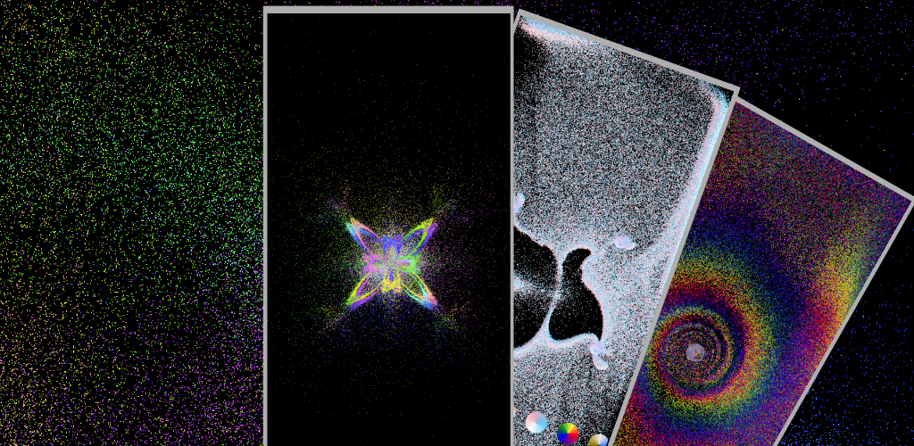

# Particles
### [jerboa.app/particles](https://jerboa.app/particles) Android app, source code

Welcome! This is source code to the Android app Particles, it is licensed under the GPL (v3). So you 
are free to view, modify, use etc the code as long as you also release it under the GPL (v3).

The app uses [Android Jetpack Compose](https://developer.android.com/jetpack/compose?gclid=CjwKCAjwq4imBhBQEiwA9Nx1Bng2Y188HWKz4WYfktYXKEIbvSbMU2oG1ElnjMk83p-jP5zKVaOZkxoC2LoQAvD_BwE&gclsrc=aw.ds) to structure the UI backend/frontent content. [Kotlin](https://kotlinlang.org/) is the main language used. Rendering is done using [Opengl ES 3.0](https://registry.khronos.org/OpenGL-Refpages/es3.0/), in particular using the old school "compute shader" technique to simulate the particle system - i.e. just Vertex and Fragment shaders are used with a single quad to integrate the equations of motion. That is GPGPU. An old tutorial is here [WaybackMachine: http://www.mathematik.uni-dortmund.de/~goeddeke/gpgpu/tutorial.html](https://web.archive.org/web/20190410185616/http://www.mathematik.uni-dortmund.de/~goeddeke/gpgpu/tutorial.html)

#### Contributing bug/error/general-annoyance reports

Open an issue for any of these!

#### Contributing Ideas

Open an issue if you have ideas for features, even if you don't know how to code them!

#### Contributing Code [fork -> branch -> pr to main]

If you have code to contribute (please feel free to open an issue outlining the scope/purpose 
if the changes may take some time to work on) commit your changes to a new branch on a forked repo. 
When ready perform a pull request to the main branch. Thanks!

It is not the end of the world if you clone-branch-pr or something else, it'll be fine. 

#### Questions

Why GPL?
- As a "complete" standalone app designed to be free and open source the GPL preserves this, and in particular not
  permitting closed source modifications. The intention is not as a library for other software to be based upon,
  where MIT, BSD, etc. are more widely used.
